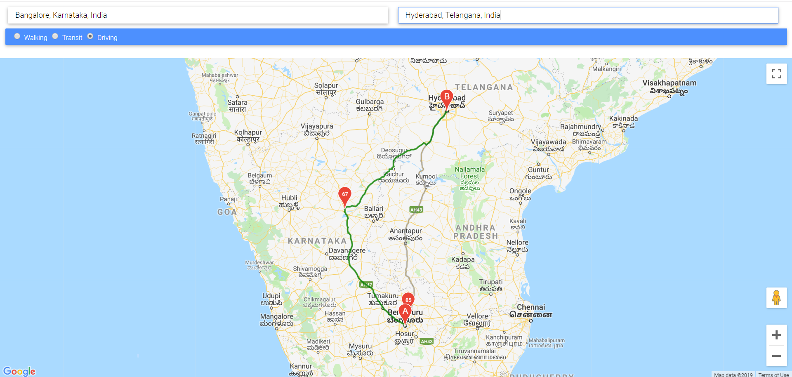

# Safe Route Advisor
This project suggests the safe route between start &amp; end destination based on Air Quality Index.

## How it works:
- First it makes a request to the google maps and get the over all length of different routes.
- The Routes are then divided by 6 to get six points in each route.
- For Route 1, as we have now 6 points i am calculating the air quality index using an opensource api i.e. api.waqi.info
- Once i have the 6 aqi for 6 points - i am calculating the average aqi for all routes.
- Then among all the average AQI's which are calculated from different routes, i am finding the smallest value and labelling that as the shoretest route.

## Work need to be done:
 - Finding an optimistic and accurate method to find the best route instead using the current average mechanism.
 - Replacing the existing code with latest javascript features like classes instead of prototyping and other concepts.
